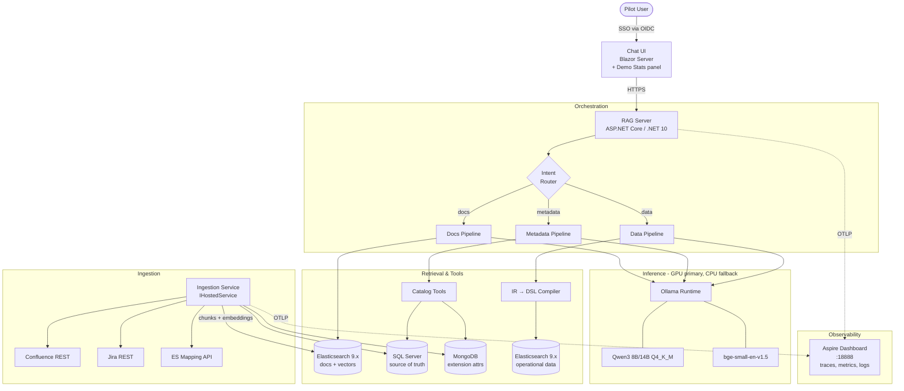
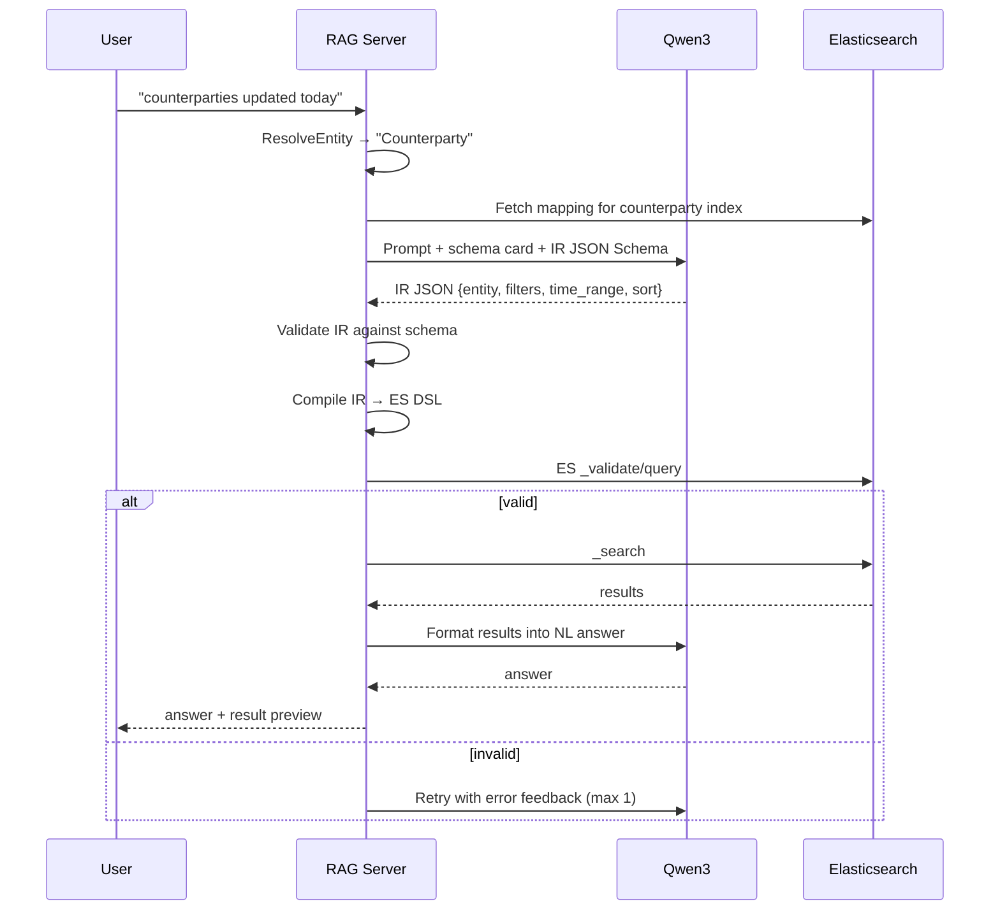
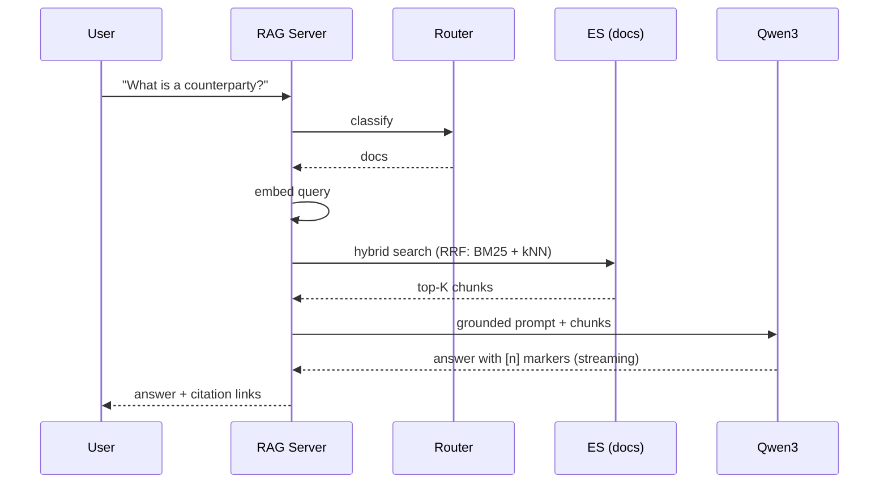
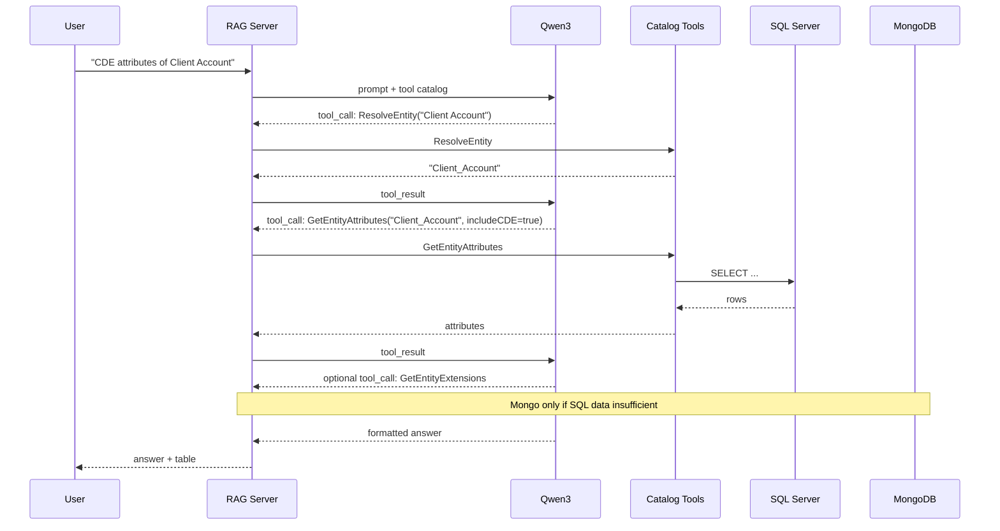
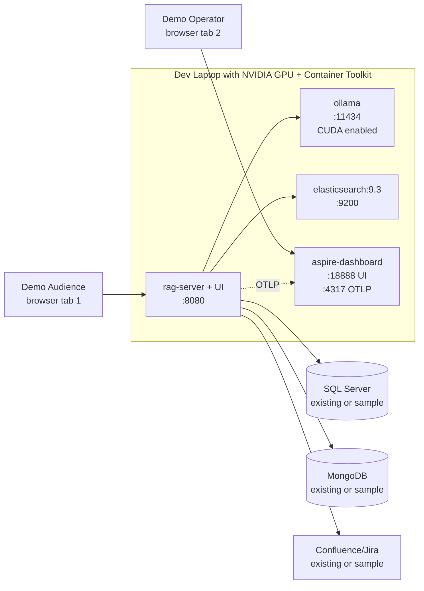
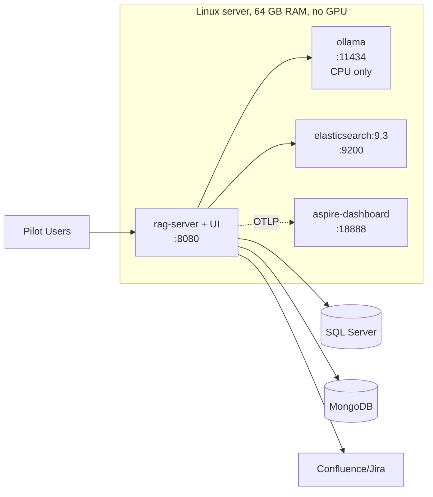

# AI Knowledge Assistant — High-Level Design (POC)

| | |
|---|---|
| **Version** | 0.7 |
| **Status** | In progress — Sprint 3 complete |
| **Scope** | Proof of Concept |
| **Date** | April 2026 |
| **Changes from 0.6** | Sprint 3 (UC-3 Data Pipeline) implemented: `QuerySpec` IR, `QuerySpecValidator`, `IrToDslCompiler` (NL → ES DSL), `DataPipeline` (validate/retry loop, SSE streaming), index-name injection guard, 148 tests green |

---

## 1. Overview

A self-hosted AI assistant that lets business users query enterprise data, metadata, and system documentation in natural language. The system combines:

- **Retrieval-Augmented Generation (RAG)** over Confluence and Jira for documentation Q&A.
- **Tool-calling against a metadata catalog** (SQL Server primary, MongoDB extension) for structured lookups about entities and their attributes.
- **Natural-language to Elasticsearch DSL translation** for ad-hoc data queries against the operational datastore.

All inference runs locally via **Ollama**, hosting **Qwen3** (8B or 14B depending on hardware) for chat and **bge-small-en-v1.5** for embeddings. The orchestration layer is a **.NET 10** service. Vector search and document retrieval run on **Elasticsearch 9.x**. End-to-end observability is provided by the **.NET Aspire Dashboard** receiving OTLP telemetry from every component.

The POC validates the architecture on developer-laptop GPUs, demonstrates the system to senior management, and produces evidence to justify procurement of a production GPU server.

---

## 2. Goals and Non-Goals

### 2.1 Goals

- Validate that a self-hosted small-model stack handles all three target use cases at acceptable quality and latency.
- Deliver a compelling working demo to senior management on developer-laptop hardware, including live observability.
- Establish reusable infrastructure (ingestion, embeddings, hybrid retrieval, tool-calling, telemetry) for future AI features.
- Produce a hardware specification for the production GPU server, supported by measured performance data.

### 2.2 Non-Goals (POC)

- **Production-grade authorisation per user.** POC runs under a service account; ACL-aware retrieval is deferred.
- **High availability / multi-region.** Single-instance deployment is sufficient.
- **Write operations.** The assistant is read-only against all sources.
- **Fine-tuning.** Out of scope; revisited only if base-model quality is the bottleneck.
- **External API fallback.** Out of scope by constraint — all inference local.
- **Multi-language support.** UK English only.
- **Conversation memory across sessions.** Per-session context only.

### 2.3 Scale and Deployment Targets

| Metric | Target |
|---|---|
| Total addressable user base | ~8 000 |
| Realistic active pilot group | A few hundred |
| Concurrent active sessions (peak) | 5–20 |
| Concurrent in-flight LLM calls | 1 per Ollama instance (queued) |

**Deployment scenarios:**

| Scenario | Hardware | Purpose |
|---|---|---|
| **Demo (primary)** | Developer laptops with NVIDIA GPU (8–16 GB VRAM) | Build, evaluate, demonstrate to management |
| **Production target** | GPU-equipped server (spec deliverable from POC) | Pilot rollout if demo is approved |
| **Documented fallback** | 64 GB RAM CPU-only server | Used only if GPU server procurement is denied |

---

## 3. Use Cases

### 3.1 UC-1: Documentation Q&A

> *"What is a counterparty and what is its purpose?"*

Classic RAG over Confluence pages and Jira issues. Hybrid retrieval, optional rerank, generation grounded in retrieved chunks with citations.

### 3.2 UC-2: Metadata Queries

> *"Give me all CDE attributes belonging to the Client Account entity."*

Structured lookup against the catalog via **tool calling**. SQL Server is the source of truth; MongoDB augments with extension attributes the SQL catalog does not carry.

### 3.3 UC-3: Data Queries

> *"Give me all counterparties whose last update date is today."*

Two-stage translation:
1. NL → **Intermediate Representation** (typed JSON: entity, filters, time range, sort, aggregations).
2. IR → **Elasticsearch DSL** via a deterministic compiler in C#.

Validated, executed, rendered. Single retry on validation failure with the error fed back to the model.

---

## 4. High-Level Architecture



### 4.1 Layered View

| Layer | Responsibility |
|---|---|
| **Presentation** | Chat UI, conversation state, citation rendering, Demo Stats panel |
| **Auth** | OIDC against existing corporate IdP |
| **Orchestration** | Intent routing, prompt assembly, tool dispatch, retry loops, request queue |
| **Inference** | Ollama-hosted Qwen3 + embedding model (CUDA when available, CPU fallback) |
| **Retrieval** | Elasticsearch 9.x hybrid search (BM25 + dense + RRF) |
| **Tools** | Typed catalog functions (SQL primary, Mongo extension), IR-to-DSL compiler, optional MCP client |
| **Sources** | Confluence, Jira, SQL Server, MongoDB, Elasticsearch (data) |
| **Ingestion** | Scheduled crawlers, chunking, embedding, indexing |
| **Observability** | Aspire Dashboard receiving OTLP from every service |
| **Cross-cutting** | Configuration, secrets, logging |

---

## 5. Component Catalog

### 5.1 Chat UI

- **Tech:** Blazor Server. Minimises moving parts for a single-developer POC; SignalR streaming integrates naturally.
- **Features:** streaming responses, message history within session, citation links, query type indicator, "show retrieved context" debug panel, **Demo Stats panel**, model badge.
- **Auth:** OIDC against existing corporate IdP. ID token forwarded to the RAG server as a bearer token.

**Demo Stats panel** (sidebar in the UI):

| Metric | Source |
|---|---|
| Last request latency (ms) | trace duration |
| Tokens generated | LLM response metadata |
| Tokens/second | computed |
| Model handling this answer | config + runtime |
| Pipeline (docs/metadata/data) | router output |
| IR validated first try (UC-3 only) | validator |
| Tool calls made (UC-2) | function-call middleware |

Purpose: keep key numbers visible during the demo without alt-tabbing to the dashboard. The Aspire Dashboard remains the deep-dive tool.

### 5.2 RAG Server (ASP.NET Core, .NET 10)

The single orchestration service. Hosts:

- **Chat endpoint** (`POST /chat`) — streaming, tool-calling capable, OIDC-authenticated.
- **Admin endpoints** — reindex triggers, health, retrieval inspection (admin-role only).
- **Background ingestion** — `IHostedService` running scheduled crawlers.
- **Request queue** — sequential dispatch into Ollama (max 1 in-flight LLM call per instance) with bounded queue and backpressure.

Built on **`Microsoft.Extensions.AI`** abstractions (`IChatClient`, `IEmbeddingGenerator`) with **OllamaSharp** as the provider. The same code runs against GPU, CPU, or a future model gateway.

### 5.3 Intent Router

A lightweight classifier that picks the pipeline:

- **Approach:** rule-based shortcuts + small-model classifier as fallback. Regex/keyword cues handle the obvious cases (`"how does"`, `"what is"` → docs; `"give me all"` + entity term → metadata or data). Ambiguous prompts go to the model with constrained output (`docs | metadata | data`).
- **Cost on GPU:** classification is a short generation (~5 tokens), <100 ms. Negligible.

### 5.4 Docs Pipeline

Standard RAG.

1. Embed the user query (`bge-small-en-v1.5`).
2. **Hybrid retrieval** in Elasticsearch using the **RRF retriever** (BM25 + kNN over the dense vector field).
3. Optional rerank — deferred for POC; add only if relevance is insufficient.
4. Top-K (initially K=5) chunks assembled into a grounded prompt with explicit citation markers.
5. Qwen3 generates the answer; citations are extracted and rendered as links to source Confluence pages or Jira issues.

### 5.5 Metadata Pipeline (Tool Calling)

SQL Server is the source of truth. MongoDB is queried for extension attributes that the SQL catalog does not model (e.g. business glossary annotations, custom flags).

**Defined tools:**

| Tool | Source | Description |
|---|---|---|
| `ResolveEntity(text)` | ES catalog index | Fuzzy-match user terms to canonical entity names |
| `GetEntityAttributes(entity, includeCDE?)` | SQL Server | Authoritative attribute list with types, nullability, classification |
| `GetEntityExtensions(entityId)` | MongoDB | Extension attributes augmenting the SQL catalog |
| `ListCDE(entity?)` | SQL Server | Critical Data Elements, optionally scoped |
| `GetEntityRelationships(entity)` | SQL Server | FKs, parent/child, lineage |

The model is given the tool catalog via `M.E.AI` function-calling middleware. The runtime executes calls, feeds results back, and lets the model compose the final answer. When both SQL and Mongo data are relevant, the system prompt instructs the model to call SQL first and Mongo second.

### 5.6 Data Pipeline (NL → IR → DSL)

The hardest path. Four discrete steps with validation between each:



**Why an IR rather than direct DSL:**

- Smaller, well-typed target — easier for a small model to hit reliably.
- Compiler is plain C#: testable, deterministic.
- Edge cases (date math, nested fields, term-vs-keyword, range queries on dates) are encoded once in the compiler, not relearned per query.
- Validation failures are caught at compile time in C#, not as ES runtime errors.

**IR shape (sketch):**

```csharp
public record QuerySpec(
    string Entity,
    IReadOnlyList<Filter> Filters,
    TimeRange? TimeRange,
    IReadOnlyList<SortClause> Sort,
    IReadOnlyList<Aggregation> Aggregations,
    int? Limit
);
```

### 5.7 Ingestion Service

A `IHostedService` running inside the RAG server (POC scale).

**Sources and cadence:**

| Source | Mechanism | Cadence | Notes |
|---|---|---|---|
| Confluence | REST API, space-by-space | Hourly incremental, daily full | `lastModified` cursor in SQL Server |
| Jira | REST API, JQL by project | Hourly incremental | Updated-since cursor |
| SQL Server catalog | Change tracking or timestamp | 15 min | Entity / attribute / CDE tables |
| MongoDB catalog | Change streams or timestamp | 15 min | Extension attributes |
| ES mapping | `_mapping` API | On demand for POC; scheduled in production | Schema cards for the data pipeline |

**Pipeline per document:**

1. Fetch raw content.
2. Normalise (HTML → text for Confluence, ADF → text for Jira).
3. Chunk (semantic chunking; ~500-token target, 50-token overlap).
4. Embed each chunk via `IEmbeddingGenerator`.
5. Upsert to Elasticsearch with `{content, vector, source_type, source_id, url, last_modified, metadata}`.

**Atlassian MCP positioning:** **not** used for ingestion. Direct REST is faster, supports cursor-based incremental sync, and gives control over rate limits. MCP is reserved for optional **query-time** tools (e.g. "fetch the latest comment on JIRA-1234").

### 5.8 Inference Layer (Ollama)

Single Ollama instance per environment. CUDA backend used when available, CPU fallback otherwise. The `M.E.AI` abstraction means the same .NET code drives both.

**Model selection per environment:**

| Environment | VRAM / RAM | Default chat model | Demo / power model | Embedding |
|---|---|---|---|---|
| Work laptop (RTX PRO 2000 Blackwell) | 8 GB VRAM | Qwen3 8B Q4_K_M | — | bge-small-en-v1.5 |
| Home laptop (RTX 3080) | 16 GB VRAM | Qwen3 8B Q4_K_M | **Qwen3 14B Q4_K_M** | bge-small-en-v1.5 |
| Future GPU server (TBD) | Spec deliverable | TBD | TBD | bge-small-en-v1.5 |
| CPU fallback (64 GB RAM) | — | Qwen3 4B Q4_K_M | Qwen3 8B Q4_K_M (slow) | bge-small-en-v1.5 |

**Runtime tuning:**

- `OLLAMA_NUM_PARALLEL=1` initially. Tune up only after measuring queue behaviour under load.
- GPU layer offload: `OLLAMA_NUM_GPU=999` (i.e. all layers) on the 16 GB laptop for 14B. On 8 GB GPUs the model fits fully without spillover at Q4_K_M.
- Quantization: Q4_K_M as default. Q5_K_M considered if quality is the bottleneck and VRAM allows.

### 5.9 Elasticsearch 9.x (dual role)

ES serves two distinct purposes — **logically separate, physically the same cluster** for the POC:

- **Vector + document store** for RAG: indices for `docs`, `catalog_terms`, `schema_cards`.
- **Operational data store** for UC-3: existing business indices, queried via the compiled DSL.

Indices use:
- `dense_vector` field for embeddings (cosine similarity, HNSW). 384 dims for `bge-small-en-v1.5`.
- BM25 on text fields.
- **RRF retriever** for hybrid queries (native and the recommended default).

**Why ES 9.x specifically:**

- Built on **Lucene 10**, bringing measurable indexing and query performance improvements over the 8.x line.
- **Better Binary Quantization (BBQ)** is GA — relevant as a future optimisation when the vector index grows beyond the POC scale (millions of vectors). Not adopted for the POC; the dataset fits comfortably in RAM with standard `dense_vector` HNSW.
- **Retriever framework** matured: linear and generic rescoring now compose alongside RRF, useful if reranking is added in Phase 2.
- **ES|QL** continues to evolve (LOOKUP JOIN, expanded functions). Out of scope for the POC's data pipeline (we generate Query DSL, not ES|QL), but worth noting as a potential simplification path for some metadata queries in production.

ES runs in Docker for the POC (single node, security minimal — `xpack.security.enabled=true` with basic auth, no TLS internal). Image: `docker.elastic.co/elasticsearch/elasticsearch:9.3.3` or current 9.x patch.

**Client-server version coupling:** the .NET client tracks server major version. ES 9.x server requires `Elastic.Clients.Elasticsearch` 9.x. Cross-major compatibility is not supported.

### 5.10 Telemetry Dashboard (.NET Aspire Dashboard)

Standalone container, Microsoft-published image (`mcr.microsoft.com/dotnet/aspire-dashboard`). Acts as the OTLP endpoint for every other component in the system; presents the unified view.

**What it shows:**

- **Traces.** Every chat request as a single trace with nested spans: HTTP → router → embedding → ES retrieval → LLM call (with token counts) → tool calls → ES query → formatting. Timing per span is visible at a glance.
- **Metrics.** Built-in .NET runtime metrics plus custom application metrics: tokens-per-second per pipeline, IR validation success rate, ES retrieval latency, queue depth, retry counts.
- **Structured logs.** Filterable, correlated to traces via trace ID.
- **Resource view.** Each service registered with the dashboard surfaces its environment, endpoints, and live state.

**Why this rather than Grafana/Prometheus/Tempo:**

- One container vs four, no PromQL or LogQL to learn.
- Native OTLP ingest matches the .NET instrumentation we already emit; zero adaptation.
- Microsoft-published — recognisable to a .NET-shop audience as a credible operational tool, not an open-source curiosity.
- Trace timeline view is exactly the right artefact for the demo: visual proof that the system performs real, traceable work.

**What it deliberately does not cover:**

- Long-term metric storage (it's intended for development/POC, not production retention).
- GPU-level utilisation (no native NVIDIA integration). For the POC, GPU monitoring is handled separately via `nvtop` in a side terminal during the demo. If polished GPU dashboards are needed later, dcgm-exporter → OTel collector → Aspire is the upgrade path; Grafana is the production-grade alternative.

**Configuration:**

- Exposes OTLP gRPC on `:4317` and HTTP on `:4318`.
- UI on `:18888`.
- All other services point at the dashboard via `OTEL_EXPORTER_OTLP_ENDPOINT` env var.

---

## 6. Data Flows

### 6.1 Documentation Query Flow



### 6.2 Metadata Query Flow



### 6.3 Data Query Flow

See §5.6.

---

## 7. Data Model

### 7.1 Elasticsearch — `docs` index

```json
{
  "mappings": {
    "properties": {
      "content":         { "type": "text" },
      "vector":          { "type": "dense_vector", "dims": 384, "index": true, "similarity": "cosine" },
      "source_type":     { "type": "keyword" },
      "source_id":       { "type": "keyword" },
      "title":           { "type": "text" },
      "url":             { "type": "keyword" },
      "space_or_project":{ "type": "keyword" },
      "last_modified":   { "type": "date" },
      "chunk_index":     { "type": "integer" }
    }
  }
}
```

`dims: 384` for `bge-small-en-v1.5`. Switching embedding models post-ingestion requires reindex.

**Production-scale optimisation (deferred):** ES 9.x supports BBQ (`int8_hnsw` / `bbq_hnsw` index types) for compressed vector storage. Not adopted for the POC because the dataset is small enough that uncompressed HNSW gives both better recall and trivially low memory. Worth re-evaluating once the production index exceeds ~1 million vectors.

### 7.2 Elasticsearch — `catalog_terms` index

Embeddings of canonical entity and attribute names plus aliases. Used by `ResolveEntity` for fuzzy term matching.

### 7.3 Elasticsearch — `schema_cards` index

Compact per-entity schema descriptions (field name, type, sample values, semantic notes) used as context for the data pipeline.

### 7.4 SQL Server — Ingestion State

| Table | Purpose |
|---|---|
| `IngestionCursor` | Per-source last-sync timestamps |
| `IngestionRun` | Run history, counts, errors |
| `EvalQueries` | Curated golden-set queries for regression testing |
| `EvalResults` | Per-run quality metrics |

### 7.5 No Conversation Persistence (POC)

Sessions are in-memory. Persistence is a Phase 2 concern.

---

## 8. Tech Stack

| Concern | Choice | Rationale |
|---|---|---|
| Runtime | .NET 10 | Team strength; performance; first-class M.E.AI |
| Web | ASP.NET Core minimal APIs + Blazor Server | Lean, single service |
| Auth | OIDC via existing IdP | Reuse existing SSO |
| LLM abstraction | `Microsoft.Extensions.AI` | Provider-agnostic chat + embeddings + function calling |
| LLM backend | Ollama via `OllamaSharp` (CUDA primary, CPU fallback) | Same runtime across all environments |
| Chat model | Qwen3 8B Q4_K_M (default), Qwen3 14B Q4_K_M (16 GB GPU) | Best quality / latency tradeoff for available VRAM |
| Embedding model | bge-small-en-v1.5 | English-only, 384 dims, fast on CPU and GPU |
| Vector + search server | **Elasticsearch 9.x** (current 9.3+) | Lucene 10, hybrid RRF, mature dense_vector, BBQ available for future scale |
| ES .NET client | **`Elastic.Clients.Elasticsearch` 9.x** | Required by ES 9.x server; tracks server major version |
| SQL access | EF Core 9 | Catalog domain rich enough to warrant it |
| Mongo access | `MongoDB.Driver` | Standard |
| Atlassian | Direct REST + `HttpClient` | Control over incremental sync |
| MCP client (optional, query-time) | `ModelContextProtocol` (C# SDK) | Integrates with M.E.AI function calling |
| Resilience | Polly v8 | Retry, circuit breaker on ES + Ollama |
| Observability instrumentation | OpenTelemetry .NET SDK | Standard, OTLP-native |
| Observability dashboard | .NET Aspire Dashboard (standalone) | One container, OTLP-native, demo-ready UI |
| GPU monitoring (POC) | `nvtop` in side terminal | Pragmatic; full integration deferred |
| Containerisation | Docker + Docker Compose | Same compose file across all environments |
| GPU support | NVIDIA Container Toolkit (pre-installed on both dev laptops) | Standard for Docker + CUDA |
| CI/CD | GitLab pipelines | Existing |
| Reranker (Phase 2) | bge-reranker-base via Python sidecar **or** ONNX Runtime in-process | Defer until measured need |

---

## 9. Deployment View

### 9.1 Demo Deployment (Developer Laptop with NVIDIA GPU)



The same `docker-compose.yml` runs on both laptops; the only difference is the model pulled into Ollama (8B on the 8 GB Blackwell, 14B on the 16 GB RTX 3080). NVIDIA Container Toolkit is already installed on both laptops; Ollama detects CUDA automatically.

### 9.2 Production Target (GPU Server, Post-Demo)

To be procured if the demo is approved. The POC produces the spec, supported by measured tokens-per-second, VRAM headroom, and concurrency profiles. Likely candidates depending on policy and budget:

- Single-GPU workstation class (e.g. RTX 5000 Ada / RTX PRO 4000 Blackwell, 24–32 GB VRAM): comfortably hosts 14B with headroom, supports limited concurrency.
- Server-class single-GPU (e.g. L40S, 48 GB VRAM): hosts 32B comfortably, multiple concurrent calls.
- Multi-GPU only if concurrency demands it; the user-base scale (hundreds of pilot users, ~5–20 concurrent) does not justify it initially.

In production, Aspire Dashboard would typically be replaced by Grafana/Prometheus/Tempo with persistent storage, but it remains valid for staging environments. Elasticsearch would be a managed multi-node cluster, potentially with separate data tiers for vector and operational indices.

A concrete recommendation is a deliverable from the POC — see §12 Phase 4.

### 9.3 CPU-only Fallback (64 GB Server, No GPU)



Used only if GPU server procurement is denied. Default model drops to Qwen3 4B Q4_K_M; latency targets relax (see §10.5). Same artifacts, same compose file.

**Resource allocation (CPU fallback):**

| Container | RAM | CPU |
|---|---|---|
| ollama | 8 GB | 8–16 threads |
| elasticsearch | 16 GB heap (32 GB total) | 4–8 cores |
| rag-server + UI | 4 GB | 2–4 cores |
| aspire-dashboard | 1 GB | 1 core |
| OS + filesystem cache headroom | ~16 GB | — |

---

## 10. Cross-Cutting Concerns

### 10.1 Security

- **OIDC-based SSO** at the edge. ID token validated by the RAG server.
- **Service-account model** for backend sources (Confluence, Jira, SQL, Mongo, ES). All credentials read-only.
- **No write paths** — the assistant never modifies any source system.
- **Secrets** in environment variables for POC; corporate vault for production.
- **PII handling:** assume Confluence and Jira may contain PII; pilot users must be authorised to see all pilot content. ACL-aware retrieval is Phase 2.
- **Prompt-injection awareness:** retrieved content is treated as untrusted; instructions found in chunks are not executed. Tool-calling is constrained to a fixed read-only catalog.
- **Aspire Dashboard exposure:** `:18888` is intended for operators only. Bind to `localhost` on demo laptops; behind auth in any non-demo deployment.

### 10.2 Observability

OpenTelemetry from day one, exporting OTLP to Aspire Dashboard:

- **Traces:** every chat request → router → retrieval → LLM call → tool call → ES query, single trace.
- **Metrics:** retrieval latency, tokens generated, tokens-per-second, tool-call counts, IR validation failure rate, ES query failure rate, queue depth.
- **Logs:** structured, correlation-ID per request.

Critical instruments for the POC: **IR validation failure rate**, **DSL retry rate**, **end-to-end p50/p95 latency per pipeline**, **tokens-per-second per environment** (for the GPU server spec recommendation).

The Aspire Dashboard surfaces all of the above. The Blazor Demo Stats panel surfaces a high-value subset directly to the user, anchored to each answer.

### 10.3 Configuration

- `appsettings.json` + environment overrides.
- Model name per pipeline is configuration. Enables side-by-side A/B (Qwen3 8B vs 14B) without redeployment — particularly useful during the demo.
- `OTEL_EXPORTER_OTLP_ENDPOINT` and `OTEL_SERVICE_NAME` set per service for clean dashboard grouping.

### 10.4 Evaluation Harness

A POC without measurement produces only opinions. Build from week one:

- **Golden set:** ~30–50 curated queries per use case with expected answers / expected DSL / expected attribute lists.
- **Automated runs:** nightly job runs the golden set, computes pass rate per pipeline.
- **Quality metrics:**
  - UC-1 (docs): retrieval recall@k, faithfulness (answer grounded in retrieved chunks).
  - UC-2 (metadata): exact match on tool selection and arguments.
  - UC-3 (data): IR schema validity, DSL execution success, result-set match against expected.
- **Cross-environment runs:** the same golden set executes on every environment (work laptop, home laptop, CPU fallback) so the demo argument is data-backed: "same questions, here's the quality and latency on each model."

### 10.5 Performance and Latency Expectations

**Per-pipeline targets, GPU primary path (Qwen3 8B Q4_K_M unless noted):**

| Pipeline | p50 target | p95 target |
|---|---|---|
| UC-1 (docs) | 3 s | 8 s |
| UC-2 (metadata) | 4 s | 10 s |
| UC-3 (data, no retry) | 5 s | 12 s |
| UC-3 (data, with retry) | 9 s | 22 s |

**Same targets, Qwen3 14B Q4_K_M on 16 GB GPU:**

| Pipeline | p50 target | p95 target |
|---|---|---|
| UC-1 (docs) | 5 s | 14 s |
| UC-2 (metadata) | 7 s | 18 s |
| UC-3 (data, no retry) | 9 s | 22 s |
| UC-3 (data, with retry) | 16 s | 38 s |

**CPU fallback (Qwen3 4B Q4_K_M on 64 GB CPU):**

| Pipeline | p50 target | p95 target |
|---|---|---|
| UC-1 (docs) | 8 s | 20 s |
| UC-2 (metadata) | 10 s | 25 s |
| UC-3 (data, no retry) | 15 s | 35 s |
| UC-3 (data, with retry) | 25 s | 60 s |

All targets aspirational; confirming or refuting them empirically is a primary POC deliverable.

**Optimisation levers (in order of impact):**

1. **Prompt economy.** System prompts, schema cards, and tool definitions all add to first-token latency. Aggressively minimise.
2. **Output caps.** `max_tokens` set per pipeline. UC-3 IR generation rarely exceeds 200 tokens; cap there.
3. **Streaming.** Always stream user-visible output. Perceived latency improves substantially.
4. **GPU offload.** All layers on GPU when VRAM allows. Mixed CPU/GPU is significantly slower than full GPU and should be avoided for the chat model.
5. **Embedding cache.** Cache query embeddings for common queries (in-process LRU, ~1000 entries).
6. **Schema-card cache.** Cache compiled schema cards in memory; rebuild on mapping change only.
7. **Request queue with backpressure.** One in-flight LLM call per Ollama instance; queue depth bounded; reject with `429` when full.

---

## 11. Risks and Mitigations

| Risk | Impact | Likelihood | Mitigation |
|---|---|---|---|
| Demo runs well on laptop but no GPU server budget approved → fallback to CPU drops perceived quality of the system | High | Medium | Explicit demo framing of hardware dependency; CPU fallback latency targets documented; honest comparison shown if asked |
| Qwen3 8B cannot generate reliable IR for UC-3 | High | Medium | A/B test against Phi-4-mini; on 16 GB GPU show 14B as direct evidence that more capable model fixes it |
| Qwen3 14B not materially better than 8B on the demo prompts → weakens GPU-server argument | Medium | Low–Medium | Curate UC-3 demo prompts where size matters (nested aggregations, complex date logic); be honest if it doesn't show — that's also a valid finding |
| Hybrid retrieval relevance insufficient for UC-1 | Medium | Medium | Add reranker; tune chunking; use Confluence labels as metadata filters |
| Confluence content quality is poor | Medium | High | Out of scope to fix; report coverage metrics so stakeholders see the gap |
| Schema drift in operational ES indices breaks UC-3 silently | High | Medium | Schema-card refresh on mapping change; alert on unexpected mapping deltas |
| Atlassian rate limits during initial backfill | Low | Medium | Token-bucket throttling in crawler; off-hours backfill |
| PII leakage via prompts or logs | High | Low–Medium | No conversation persistence; redact PII in logs; pilot user group restricted |
| Prompt-injection via Confluence content | Medium | Low | Read-only tool catalog; output filtering; untrusted content handling |
| Demo laptop hardware difference between dev and presentation environments (driver, CUDA versions) | Medium | Low | Both laptops kept in sync; rehearse on the actual demo machine; have backup laptop |
| Aspire Dashboard data lost on container restart (no persistence) | Low | High (intended behaviour) | Acceptable for POC; production replaces with Grafana/Tempo with persistent storage |
| ES 9.x specific behaviour change vs 8.x assumed in third-party docs | Low | Low | Pin to current 9.x patch; consult ES 9 breaking-changes doc; .NET client tracks server version |

---

## 12. Roadmap / Phasing

### Phase 0 — Foundation (1 week)
Reduced from 1–2 weeks; NVIDIA Container Toolkit confirmed pre-installed on both laptops removes the largest Phase 0 risk.

- Docker Compose: Ollama + ES 9.x + RAG server + UI + Aspire Dashboard.
- Validation smoke tests: GPU exposed to Ollama (Appendix D), end-to-end OTLP trace from RAG server to Aspire.
- M.E.AI wired up; smoke-test chat against Qwen3 8B on both laptops.
- Golden-set scaffolding (empty dataset, runner, metrics).
- OIDC auth wired up.

### Phase 1 — UC-1 Documentation Q&A (2 weeks)
- Confluence + Jira ingestion.
- Chunking + embeddings + ES indices.
- Hybrid retrieval (RRF retriever), grounded generation, citations.
- Golden set populated (~30 questions).

### Phase 2 — UC-2 Metadata Queries (2 weeks)
- Catalog tool definitions (SQL primary + Mongo extension).
- M.E.AI function-calling loop.
- Entity resolution via `catalog_terms` index.
- Golden set extended.

### Phase 3 — UC-3 Data Queries (3–4 weeks)
- IR schema, validation, compiler.
- Schema-card ingestion.
- Validation/retry loop.
- A/B model comparison (Qwen3 8B vs 14B on the home laptop; vs Phi-4-mini).
- Golden set extended.

### Phase 4 — Demo Preparation and Senior Management Presentation (2 weeks)
- Curated demo script covering all three use cases.
- Side-by-side 8B vs 14B comparison on UC-3 prompts (home laptop).
- Latency profiling: charted tokens-per-second per environment.
- Hardware recommendation: production GPU server spec with rationale.
- Demo Stats panel polished; Aspire Dashboard pre-arranged with relevant views.
- Stakeholder rehearsal; fallback plans for technical issues.

**Total POC: ~10–11 weeks** for a single engineer.

### 12.1 Demo Strategy

**Demo principles:**

1. **Frame the hardware story up front.** One slide stating: "Demo runs on laptop GPU. Production target is a dedicated GPU server. CPU-only deployment is documented as a fallback option." This pre-empts the inevitable "what does this cost to run" question.
2. **Lead with UC-3.** Visually the most compelling — natural language directly into ES results in seconds. UC-1 and UC-2 sell themselves once UC-3 has landed.
3. **Show side-by-side comparison.** Same UC-3 prompt on Qwen3 8B and 14B. Concrete, visual evidence that VRAM (i.e. a server-grade GPU) materially improves quality.
4. **Show the dashboard live.** A second tab on the Aspire Dashboard, switched to during a key UC-3 prompt. The trace timeline visually proves the system is doing real, measurable work — embedding, retrieval, LLM call, tool calls, ES query, all timed and traceable. Senior management at a corporate environment values this kind of operational transparency.
5. **Show the failure case honestly.** Run one prompt the model gets wrong, explain why, explain the validation/retry loop. Builds credibility.
6. **End with the ask.** Production GPU server spec with measured numbers. The demo is the evidence; the spec is the deliverable.

**Demo content checklist:**

- Pre-loaded golden-set examples for each use case (UC-1, UC-2, UC-3) — known-good, fast, illustrative.
- One "interesting" UC-3 prompt where 14B wins clearly over 8B.
- Live latency display in the UI (Demo Stats panel).
- Aspire Dashboard pre-opened in browser tab 2; trace view filtered to last 5 minutes.
- `nvtop` running in a terminal on the demo machine, showing GPU utilisation live.
- Backup video recording in case live demo fails.
- Both laptops on hand; one as primary, one as backup.

---

## 13. Open Questions

1. **Pilot user group scope.** Which business area, which data domain? Affects content scope and golden-set design.
2. **Production GPU server target spec.** Deliverable from the POC, but the procurement decision will hinge on budget envelope — worth having an early indicative range from infrastructure/finance.
3. **Demo audience and date.** Who attends, how long, what's their decision authority? Affects depth of demo content and post-demo path.

Earlier open questions — resolved:

- ~~Czech vs English content split~~ → English only.
- ~~External API fallback allowed?~~ → No.
- ~~Auth model~~ → Existing OIDC SSO.
- ~~Production owner~~ → Same team.
- ~~Catalog source of truth~~ → SQL Server primary, MongoDB extension.
- ~~Vector store consolidation~~ → Single ES cluster, separate indices.
- ~~CPU specification~~ → Demo on laptop GPUs (RTX PRO 2000 Blackwell 8 GB, RTX 3080 16 GB); CPU server documented as fallback.
- ~~Telemetry/dashboard tool~~ → .NET Aspire Dashboard; Demo Stats panel inside Blazor UI; `nvtop` for GPU.
- ~~NVIDIA Container Toolkit availability~~ → Confirmed pre-installed on both dev laptops.
- ~~Elasticsearch version~~ → 9.x (current 9.3+).

---

## Appendix A — Glossary

| Term | Definition |
|---|---|
| RAG | Retrieval-Augmented Generation |
| IR | Intermediate Representation — the typed JSON shape between NL and ES DSL |
| DSL | Domain-Specific Language — here, the Elasticsearch Query DSL |
| RRF | Reciprocal Rank Fusion — hybrid-search ranking method |
| BBQ | Better Binary Quantization — ES 9.x compressed vector storage |
| CDE | Critical Data Element |
| MCP | Model Context Protocol |
| M.E.AI | `Microsoft.Extensions.AI` |
| OIDC | OpenID Connect |
| OTLP | OpenTelemetry Protocol |

## Appendix B — Reference Stack Versions

| Component | Version |
|---|---|
| .NET | 10.0 |
| **Elasticsearch server** | **9.3.x (current 9.x patch)** |
| **`Elastic.Clients.Elasticsearch`** | **9.x (matching server)** |
| Ollama | latest |
| Qwen3 chat | 8B Q4_K_M (default), 14B Q4_K_M (16 GB GPU), 4B Q4_K_M (CPU fallback) |
| Phi-4-mini | 3.8B Q4_K_M (A/B alternative) |
| Embedding model | bge-small-en-v1.5 (384 dims) |
| `Microsoft.Extensions.AI` | latest stable |
| Polly | v8 |
| Aspire Dashboard | mcr.microsoft.com/dotnet/aspire-dashboard:latest |
| NVIDIA Container Toolkit | latest (pre-installed) |

## Appendix C — Demo Hardware Reference

| Laptop | GPU | VRAM | Default model | Demo role |
|---|---|---|---|---|
| Work | RTX PRO 2000 Blackwell | 8 GB GDDR7 | Qwen3 8B Q4_K_M | Primary demo machine; cross-checks consistency |
| Home | RTX 3080 (laptop) | 16 GB GDDR6 | Qwen3 14B Q4_K_M | Power demo: shows model-size benefit |

Both laptops have NVIDIA Container Toolkit and WSL2 confirmed available.

## Appendix D — NVIDIA Container Toolkit Verification

The toolkit is available on the host when this command prints the GPU table from inside a container:

```bash
docker run --rm --gpus all nvidia/cuda:12.4.0-base-ubuntu22.04 nvidia-smi
```

Pre-flight checks before this command:

| Check | Command | Expected |
|---|---|---|
| Driver visible to host | `nvidia-smi` (PowerShell or shell) | GPU table |
| WSL2 present (Windows only) | `wsl --version` | Version 2 |
| Docker uses WSL2 backend (Windows only) | Docker Desktop Settings | "Use WSL 2 based engine" enabled |
| Toolkit installed (Linux only) | `dpkg -l \| grep nvidia-container-toolkit` | Package present |

End-to-end smoke test with Ollama:

```bash
docker run -d --gpus all -v ollama:/root/.ollama -p 11434:11434 --name ollama ollama/ollama
docker exec -it ollama ollama run qwen3:8b
# In another terminal: nvidia-smi should show ollama process with VRAM in use
```

Both POC dev laptops have already passed these checks; this appendix is retained for reproducibility on future hosts (production GPU server, additional dev machines).

---

*End of document.*
